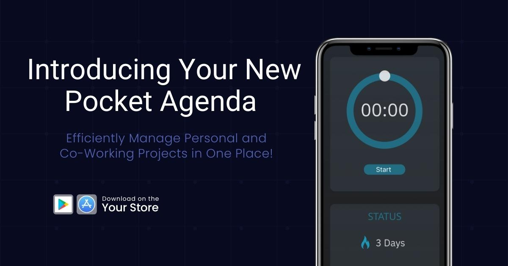
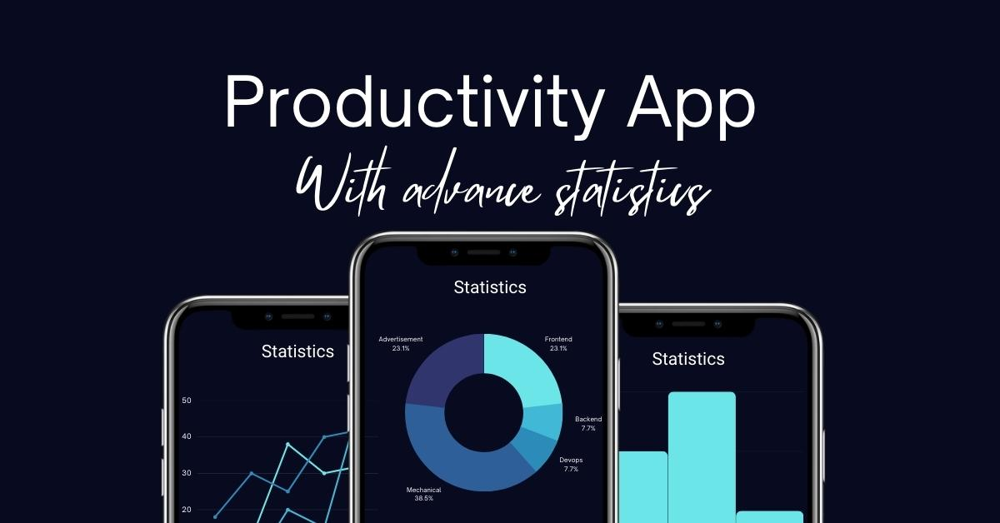
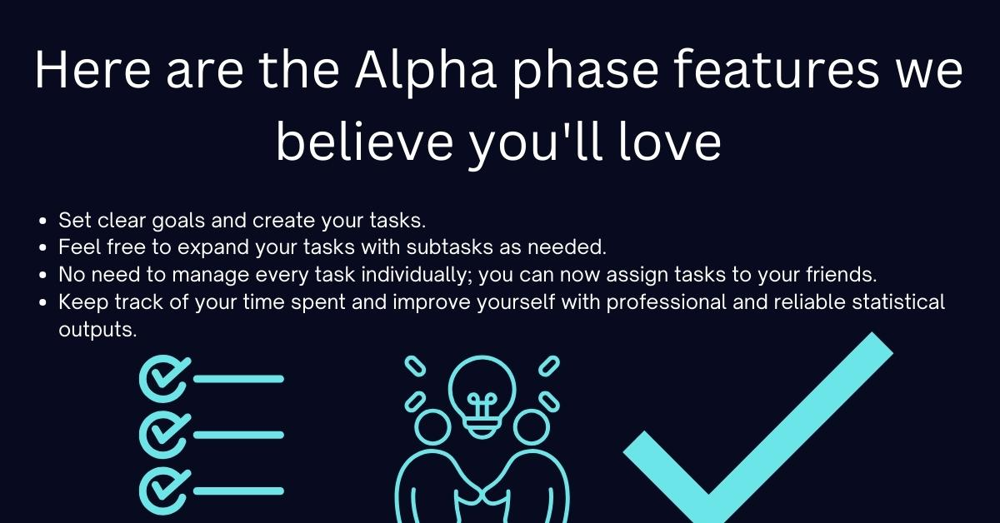

# Productivity-App

## Introducing Your New Pocket Agenda - Efficiently Manage Personal and Co-Working Projects in One Place!



We're excited to introduce your new agenda, now conveniently available right in your pocket. Just open the application and start efficiently managing all your personal and co-working projects in one place.



### Here are the Alpha phase features we believe you'll love:

- Set clear goals and create your tasks.
- Feel free to expand your tasks with subtasks as needed.
- No need to manage every task individually; you can now assign tasks to your friends.
- Keep track of your time spent and improve yourself with professional and reliable statistical outputs.



## Installation:

```
$ cd my-app

$ sudo npm install

$ npx expo start
```

## Enjoy organizing your tasks and projects with this innovative app!
